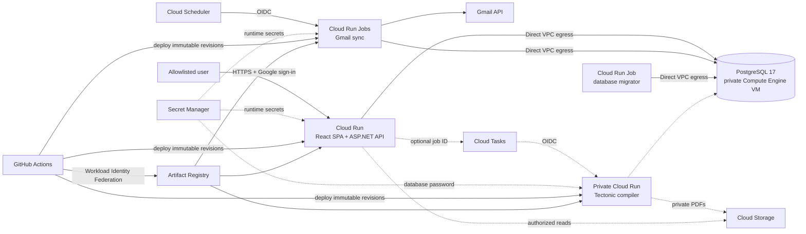

# Job Parser — Personal Google Cloud Infrastructure

Terraform infrastructure for the secure, low-cost personal deployment of
[Job Parser](../../../../README.md), a .NET and React application that imports
job-alert emails, tracks recruitment workflows, and optionally compiles
versioned TeX CVs into private PDFs.

This environment favors strong security boundaries and scale-to-zero services
over unnecessary enterprise complexity. It is intentionally sized for two
allowlisted users, not for high-traffic multi-tenant workloads.

## Overview

This Terraform root provisions the Google Cloud resources required to run the
application, its scheduled Gmail imports, database migrations, and the optional
asynchronous PDF compiler. This profile enables the public demo and PDF
compilation while keeping AI CV generation disabled.

The design combines:

- a public, scale-to-zero Cloud Run service for the React SPA and ASP.NET API;
- scheduled Cloud Run jobs for Gmail synchronization;
- a private PostgreSQL 17 container on a low-cost Compute Engine VM;
- an optional private compiler service invoked asynchronously through Cloud
  Tasks;
- Secret Manager, private Cloud Storage, least-privilege service accounts, and
  keyless GitHub Actions deployment.

Terraform state is stored in a private, versioned Google Cloud Storage bucket
configured through the ignored `backend.hcl` file. The bucket is a bootstrap
resource: it must exist before `terraform init`, and Terraform does not manage
or delete it.

## Architecture



Cloud Run reaches PostgreSQL over Direct VPC egress. The database VM has no
external IPv4 address, and local administration is available only through an
Identity-Aware Proxy SSH tunnel.

## Functionality

- Provisions a custom VPC, regional subnet, Private Google Access, and narrowly
  scoped firewall rules.
- Runs PostgreSQL 17 on Container-Optimized OS with a separate
  deletion-protected data disk.
- Creates daily database disk snapshots with seven-day retention.
- Deploys a request-billed Cloud Run web service with zero minimum instances
  and a single maximum instance.
- Runs EF Core database migrations as a dedicated one-shot Cloud Run job.
- Schedules up to two isolated Gmail synchronization jobs with Cloud Scheduler.
- Optionally dispatches CV compilation by job ID through a rate-limited Cloud
  Tasks queue to an internal-only, single-concurrency compiler service.
- Stores generated PDF artifacts in a private Cloud Storage bucket.
- Stores secret values outside Terraform state and injects them from Secret
  Manager only into the workloads that require them.
- Uses separate runtime identities and least-privilege IAM grants for the web
  app, database, migrations, Gmail sync, scheduling, compilation, and CI/CD.
- Supports keyless GitHub Actions authentication through Workload Identity
  Federation restricted to the configured repository's `main` branch.
- Deploys digest-pinned `linux/amd64` application, compiler, and PostgreSQL
  container images from a private Artifact Registry repository.
- Provides helper scripts for an IAP database tunnel and secret-safe local
  access to the remote PostgreSQL instance.

## Technology stack

| Area | Technologies |
|---|---|
| Infrastructure as Code | Terraform `>= 1.10, < 2.0`, HashiCorp Google provider `~> 8.0` |
| Cloud runtime | Google Cloud Run services and jobs, Cloud Scheduler, Cloud Tasks |
| Compute and networking | Compute Engine, Container-Optimized OS, VPC, Direct VPC egress, firewall rules, IAP, OS Login |
| Data and storage | PostgreSQL 17, Persistent Disk snapshots, Google Cloud Storage |
| Security and identity | IAM, service accounts, Secret Manager, Workload Identity Federation, Google OpenID Connect/OAuth |
| Containers and delivery | Docker Buildx, Artifact Registry, GitHub Actions, digest-pinned images |
| Deployed application | .NET 10, ASP.NET Core, Entity Framework Core, React, TypeScript, Vite |
| Document pipeline | TeX, Tectonic, private PDF artifacts |
| Operations | Google Cloud CLI (`gcloud`), Bash helper scripts, health probes |

## CV-ready project description

### Short version

Designed and implemented a security-focused, low-cost Google Cloud deployment
for a .NET 10 and React job-application platform using Terraform, Cloud Run,
private PostgreSQL, Cloud Tasks, Secret Manager, and keyless GitHub Actions
deployments.

### Detailed bullet version

- Built modular Terraform infrastructure for a full-stack .NET 10/React
  application, combining scale-to-zero Cloud Run services and jobs with a
  private PostgreSQL 17 database on Compute Engine.
- Secured the platform with private networking, IAP/OS Login administration,
  workload-specific service accounts, least-privilege IAM, Secret Manager, and
  private artifact storage.
- Automated scheduled Gmail ingestion and asynchronous, OIDC-authenticated TeX
  CV compilation using Cloud Scheduler, Cloud Tasks, Tectonic, and Cloud
  Storage.
- Implemented keyless CI/CD from GitHub Actions with Workload Identity
  Federation, private Artifact Registry images, immutable digest deployments,
  database migrations, and health verification.

## Deployment profile and limitations

- Intended for a personal, two-user deployment with low baseline cost.
- Public demo mode and PDF compilation are enabled when the application and
  compiler images are configured; AI CV generation remains disabled.
- PDF compilation is opt-in through `cv_compilation_enabled`.
- PostgreSQL is single-zone; daily snapshots improve recoverability but do not
  provide high availability.
- The Cloud Run web service is capped at one instance to protect the small
  database VM and control cost.
- Terraform creates secret containers and IAM bindings, but secret **values**
  must be added separately so they never enter Terraform configuration or
  state.
- The remote Terraform state bucket is bootstrapped separately and is not
  destroyed with this environment.

For the broader target architecture, see
[Future GCP Architecture](../../../../docs/CLOUD_ARCHITECTURE.md). For secret
ownership and deployment configuration, see
[Configuration](../../../../docs/CONFIGURATION.md).

## Repository map

| Path | Responsibility |
|---|---|
| `cloud_run.tf` | Web service, migration job, Gmail jobs, and scheduler triggers |
| `cv_compilation.tf` | Optional Cloud Tasks queue and private compiler service |
| `compute.tf` | PostgreSQL VM, protected data disk, and snapshot policy |
| `network.tf` | VPC, subnet, Private Google Access, and firewall rules |
| `cloud_run_iam.tf`, `iam.tf` | Runtime identities and least-privilege access |
| `secrets.tf` | Secret Manager containers and operator/runtime permissions |
| `artifact_registry.tf` | Private Docker image repository |
| `storage.tf` | Private PDF artifact bucket |
| `github_deployment.tf` | GitHub Workload Identity Federation and deployer permissions |
| `templates/postgres-startup.sh.tftpl` | Idempotent PostgreSQL VM bootstrap |
| `scripts/` | IAP tunnel and secret-safe remote database helpers |
| `terraform.tfvars.example` | Safe, non-secret input template |
| `backend.hcl.example` | Remote-state backend template |

## Prerequisites

- A Google Cloud project with billing enabled.
- Terraform 1.10 or newer, but earlier than 2.0.
- Google Cloud CLI with an account permitted to create the documented
  resources and IAM bindings.
- Docker with Buildx for mirroring and publishing `linux/amd64` images.
- A private, globally unique Cloud Storage bucket for remote Terraform state.

## Deployment guide

### Local setup

Authenticate with Application Default Credentials:

```bash
gcloud auth application-default login
```

Create the ignored local variable and backend files:

```bash
cp terraform.tfvars.example terraform.tfvars
cp backend.hcl.example backend.hcl
```

Replace the placeholders in both files. Set `project_id` and `operator_email`
in `terraform.tfvars`, and set the same project's private state-bucket name in
`backend.hcl`. Terraform grants the operator account IAP tunnel access, OS
Login administrator access, and permission to use the database VM's service
account while connecting.

Export the same non-secret identifiers for the copy-and-paste commands below:

```bash
export JOBPARSER_GCP_PROJECT_ID="your-gcp-project-id"
export JOBPARSER_GCP_REGION="us-central1"
export JOBPARSER_GCP_ZONE="us-central1-a"
export JOBPARSER_TF_STATE_BUCKET="your-gcp-project-id-jobparser-tfstate"
```

Create the state bucket once before the first initialization:

```bash
gcloud storage buckets create "gs://${JOBPARSER_TF_STATE_BUCKET}" \
  --project="${JOBPARSER_GCP_PROJECT_ID}" \
  --location="${JOBPARSER_GCP_REGION}" \
  --default-storage-class=STANDARD \
  --uniform-bucket-level-access \
  --public-access-prevention
gcloud storage buckets update "gs://${JOBPARSER_TF_STATE_BUCKET}" \
  --versioning
```

Then initialize and validate the configuration:

```bash
terraform init -backend-config=backend.hcl
terraform fmt -check -recursive
terraform validate
```

If this checkout was initialized before backend values moved to `backend.hcl`,
run `terraform init -reconfigure -backend-config=backend.hcl` once instead.

Do not run `terraform apply` until the first infrastructure slice has been
reviewed.

### Mirror the PostgreSQL image

The `e2-micro` VM uses `linux/amd64`. Preserve the upstream multi-platform
manifest when copying PostgreSQL to Artifact Registry; pulling and pushing the
image normally from an Apple Silicon Mac copies only `linux/arm64` and the
container then fails with `exec format error`.

```bash
gcloud auth configure-docker "${JOBPARSER_GCP_REGION}-docker.pkg.dev"
docker buildx imagetools create \
  --tag "${JOBPARSER_GCP_REGION}-docker.pkg.dev/${JOBPARSER_GCP_PROJECT_ID}/jobparser-containers/postgres:17-alpine" \
  docker.io/library/postgres:17-alpine
docker buildx imagetools inspect \
  "${JOBPARSER_GCP_REGION}-docker.pkg.dev/${JOBPARSER_GCP_PROJECT_ID}/jobparser-containers/postgres:17-alpine"
```

Set `postgres_image_digest` to the resulting top-level index digest. The VM
bootstrap also requests `linux/amd64` explicitly so an incompatible
single-platform digest fails during the pull rather than repeatedly crashing
at container startup.

### Personal database VM

The first infrastructure slice creates:

- a custom regional VPC and `/24` subnet;
- Private Google Access on that subnet;
- an ingress firewall rule allowing SSH only from Google's IAP range;
- a dedicated VM service account with logging and monitoring writer roles;
- a private regional Artifact Registry Docker repository;
- repository permissions for the operator and VM service account.

The next secret-bootstrap slice creates a Secret Manager secret and IAM
permissions, but deliberately does not manage the secret value in Terraform.
This keeps the database password out of configuration, plans, and state.

`database_vm_enabled` defaults to `false`. This lets the private PostgreSQL 17
image be copied into Artifact Registry before the internal-only VM exists.

After the image is available, enabling the VM creates:

- a single-zone `e2-micro` VM with a 10 GiB standard boot disk;
- Container-Optimized OS, which includes the Docker runtime;
- a separate, deletion-protected 20 GiB standard PostgreSQL data disk;
- daily data-disk snapshots retained for seven days.

The VM bootstrap is idempotent across reboots. It formats the data disk only
when it has no filesystem, mounts it, obtains the password using the VM service
account, pulls the digest-pinned private image, and starts PostgreSQL. The
password is held in `/run` and is not placed in VM metadata or Terraform state.
Docker's credential-helper configuration is written under the writable
`/var/lib` state partition because the Container-Optimized OS root filesystem
is read-only.

PostgreSQL port 5432 is never exposed publicly. The VPC firewall permits it
only from Cloud Run revisions carrying the `jobparser-cloud-run` network tag.
Administration uses OS Login over IAP, and local database access requires an
IAP SSH tunnel. Container images are pulled privately from Artifact Registry
through Private Google Access; the VM requires neither Cloud NAT nor an
external address.

Start the tunnel from the local machine and keep the process running:

```bash
gcloud compute ssh jobparser-db \
  --project="${JOBPARSER_GCP_PROJECT_ID}" \
  --zone="${JOBPARSER_GCP_ZONE}" \
  --tunnel-through-iap \
  -- -N -L 127.0.0.1:5433:127.0.0.1:5432
```

Connect the application or a database client to `127.0.0.1:5433` using database
and user `jobparser` plus the password that was added to Secret Manager. The
tunnel uses the normal local `gcloud` SSH key and may prompt for its passphrase.

The checked-in helper scripts keep the password out of shell history and local
configuration files. From this directory, run the tunnel in one terminal:

```bash
./scripts/db-tunnel.sh
```

Run each local process through the Secret Manager wrapper in another terminal:

```bash
./scripts/with-remote-db.sh \
  dotnet run --project ../../../../src/App.Api --launch-profile http
```

The wrapper verifies the tunnel, reads the password directly from Secret
Manager, limits the local application's PostgreSQL pool to ten connections, and
passes the connection string only through the child process environment. It
does not print or persist the password.

Keep the old local Docker volume stopped rather than deleting it until the
remote database has passed the reboot and snapshot-restore checks:

```bash
docker compose --project-directory ../../../.. stop postgres
```

Pre-migration dumps are stored under the ignored `.private-backups/` directory.
They contain private application data and must never be committed.

### Migration verification

Before cutover, compare the source and destination table counts and retain a
verified custom-format dump under the ignored `.private-backups/` directory
with mode `0600`. Keep the old local Docker volume stopped and available until
the cloud database passes verification.

Test a VM reboot to confirm that the data disk remounts and PostgreSQL starts
without reinitializing the database. Restore a recent snapshot to a temporary
disk, open it with an isolated PostgreSQL container, and compare its key table
counts with the primary database. Keep concrete snapshot names and migration
dates in private operational notes rather than this repository.

Terraform state and real `.tfvars` files are intentionally excluded from Git.
Commit `.terraform.lock.hcl` so provider selections remain reproducible.

### Low-cost Cloud Run application

The base cloud runtime keeps AI CV generation disabled. PDF compilation can be
enabled independently from AI tailoring after its compiler image is bootstrapped.
One approximately 110 MB `linux/amd64` application image contains three entry points:

- `/app/api/App.Api.dll` for the React SPA and ASP.NET API;
- `/app/database-migrator/App.DatabaseMigrator.dll` for EF migrations;
- `/app/gmail-sync/App.GmailSync.dll` for scheduled one-shot imports.

Cloud Run uses request-based billing, zero minimum instances, one maximum web
instance, 512 MiB RAM, and Direct VPC egress. Public demo is enabled while AI
generation remains disabled in this profile. Gmail jobs run on the configured schedule and exit
after one synchronization pass.

When `cv_compilation_enabled` is true, a separate compiler image runs as an
internal-only Cloud Run service with zero minimum instances and concurrency one.
Cloud Tasks invokes it with an OIDC token and a job-ID-only payload. Tectonic runs
as a non-root user in untrusted, cached-only mode, and PDFs are stored in a
private Cloud Storage bucket.

#### Bootstrap order

1. Set `github_repository` in `terraform.tfvars`, keep
   `application_runtime_enabled = false`, review `terraform plan`, and apply the
   identity/secret-container slice.
2. Build and push the first immutable image from the repository root:

   ```bash
   docker buildx build \
     --platform linux/amd64 \
     --push \
     --tag "${JOBPARSER_GCP_REGION}-docker.pkg.dev/${JOBPARSER_GCP_PROJECT_ID}/jobparser-containers/application:bootstrap" \
     .
   gcloud artifacts docker images describe \
     "${JOBPARSER_GCP_REGION}-docker.pkg.dev/${JOBPARSER_GCP_PROJECT_ID}/jobparser-containers/application:bootstrap" \
     --format='value(image_summary.digest)'
   ```

3. Set `application_image` to the returned `.../application@sha256:...`
   reference. Enable the runtime with authentication still disabled and Gmail
   accounts still empty. Apply, then read `terraform output web_service_url`.
4. Create a Google OAuth client of type Web application. Register
   `<web_service_url>/signin-google`, place its client secret in a temporary
   file outside the repository, and add it without putting the value in shell
   history:

   ```bash
   gcloud secrets versions add jobparser-google-auth-client-secret \
     --data-file=/absolute/private/path/google-auth-client-secret.txt
   ```

5. Set `application_base_url`, `authentication_google_client_id`,
   `authentication_enabled = true`, and both `allowed_users`. Apply again.
6. Execute the database migration job before signing in:

   ```bash
   gcloud run jobs execute jobparser-db-migrate \
     --project="${JOBPARSER_GCP_PROJECT_ID}" \
     --region="${JOBPARSER_GCP_REGION}" \
     --wait
   ```

7. For each Gmail account, add the common desktop OAuth client secret and the
   account's refresh token to their Secret Manager containers, then add the
   corresponding `gmail_sync_accounts` entry and apply. Secret values are never
   Terraform variables and never enter Terraform state.

#### Enable PDF compilation

Build and push the initial compiler image from the repository root:

```bash
docker buildx build \
  --platform linux/amd64 \
  --file Dockerfile.compiler \
  --push \
  --tag "${JOBPARSER_GCP_REGION}-docker.pkg.dev/${JOBPARSER_GCP_PROJECT_ID}/jobparser-containers/compiler:bootstrap" \
  .
gcloud artifacts docker images describe \
  "${JOBPARSER_GCP_REGION}-docker.pkg.dev/${JOBPARSER_GCP_PROJECT_ID}/jobparser-containers/compiler:bootstrap" \
  --format='value(image_summary.digest)'
```

Set `compiler_image` to the returned digest-pinned reference and set
`cv_compilation_enabled = true`. Review `terraform plan` before applying. This
creates the private artifact bucket, compiler identity and service, one-at-a-time
Cloud Tasks queue, and least-privilege IAM. AI tailoring remains disabled.

#### Automatic deployment

Terraform creates a Workload Identity Federation provider and a deployment
service account when `github_repository` is set. Add these repository variables
in GitHub Actions using the Terraform outputs:

```text
GCP_PROJECT_ID                  = the project_id value from terraform.tfvars
GCP_REGION                      = the deployment region, for example us-central1
GCP_ARTIFACT_REPOSITORY         = jobparser-containers
GCP_WORKLOAD_IDENTITY_PROVIDER = terraform output -raw github_workload_identity_provider
GCP_DEPLOYER_SERVICE_ACCOUNT   = terraform output -raw github_deployer_service_account
GCP_DEPLOY_ENABLED             = true
GCP_CV_COMPILATION_ENABLED     = true
```

Before `GCP_DEPLOY_ENABLED` is set, the deployment workflow safely remains
skipped. Afterwards, every push to `main` runs backend and frontend checks,
builds and pushes digest-pinned images, runs the migration job, updates Gmail
jobs, deploys the compiler revision when enabled, deploys the web revision, and
verifies `/api/health`. Terraform continues to own service configuration while
the workflow owns container-image revisions.
